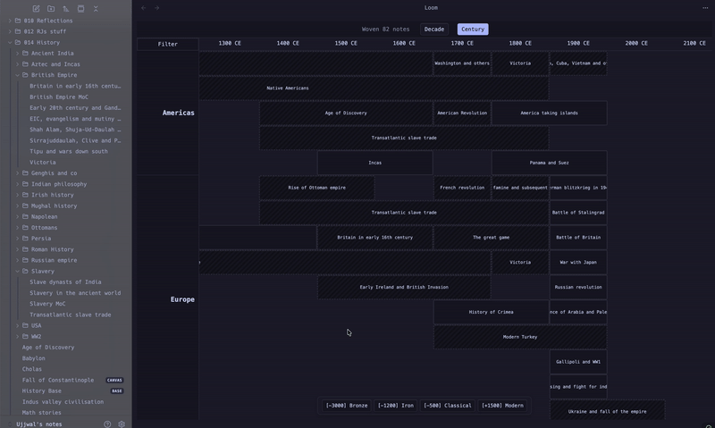

# Loom View

Loom View is a powerful, grid-based visualization plugin for historical research, world-building, and project tracking. Unlike linear timelines, Loom View uses a "Warp and Weft" approach—mapping time across the X-axis and geographic regions (or custom categories) across parallel horizontal lanes.



✨ Key Features

- **Regional Simultaneity:** View what was happening in different parts of the world (or different plot threads) side-by-side in dedicated lanes.
- **The Entity Glow:** Hover over any note to instantly highlight every other event sharing the same key-figures or mentors, revealing the hidden "threads" of history.
- **Dual-Track Date Engine:**
  - Standard: Handles Gregorian BCE/CE dates natively (e.g., -500 becomes 500 BCE).
  - Custom: Supports fictional calendars (e.g., Era 450) while maintaining correct mathematical positioning.
- **Configurable:** Customize your zoom increments (Year/Decade/Century), era-jump bookmarks, and lane ordering.
- **Data Scoping:** Focus your Loom on specific folders or tags to keep the visualization performant and relevant.

> **Note:** Loom auto-detects whether your notes use integer years (e.g. `-44`) or full dates (e.g. `2026-01-01`). You cannot mix both in the same view—whichever format appears first in your scoped files determines the mode. Use year-based keys for historical/vault-wide timelines, or date-based keys for journals, project logs, and contemporary notes.

🚀 Getting Started

1.  **The Metadata Schema**
    Loom View reads your Markdown frontmatter. For a note to appear on the Loom, it typically needs:

    ```yaml
    region: [Europe] # Your Lane/Row property
    year-start: -44 # Your Start Date
    year-end: -44 # Your End Date
    key-figures: [Caesar] # Used for the connections to other notes
    ```

2.  **Configure the Settings**
    Go to Settings -> Loom View to map your custom vault structure:
    - **Property Mapping:** Tell Loom View which keys you use for dates and lanes (e.g., if you use start-date instead of year-start).
    - **Lane Order:** Define the vertical order of your regions (e.g., Americas, Europe, South-Asia).
    - **Data Scope:** Select the folders or tags Loom View should "weave" into the view.

🛠 Usage

Use the Command Palette: "Loom View: Open Loom View".

- **Zoom:** Use the top buttons to switch between granularities (1y, 10y, 100y).
- **Navigate:** Use Shift + Scroll to move through time or use the Era-Snap buttons at the bottom to jump to specific periods. In year mode, bookmarks use years (e.g. `Bronze: -3000`). In date mode, use full dates (e.g. `Week 1: 2026-01-01`).
- **Filter:** Use the Lane Filter to solo specific regions for comparison.
- **Move around:** Hover over any note to instantly highlight every other event sharing the same key-figures or mentors, revealing the hidden "threads" of history.

🎨 Inspiration for Use Cases

- **Historians:** Compare the rise and fall of empires across continents simultaneously.
- **World Builders:** Track parallel plotlines across different fictional kingdoms or planets.
- **Artists & Researchers:** Visualize which artists were active in the same cities at the same time and who mentored whom.
- **Book Trackers:** Map your reading history across genres or authors over the years.

📜 License
MIT License. Built with ❤️ for the Obsidian community.
